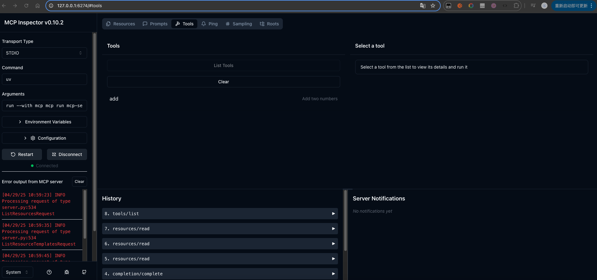
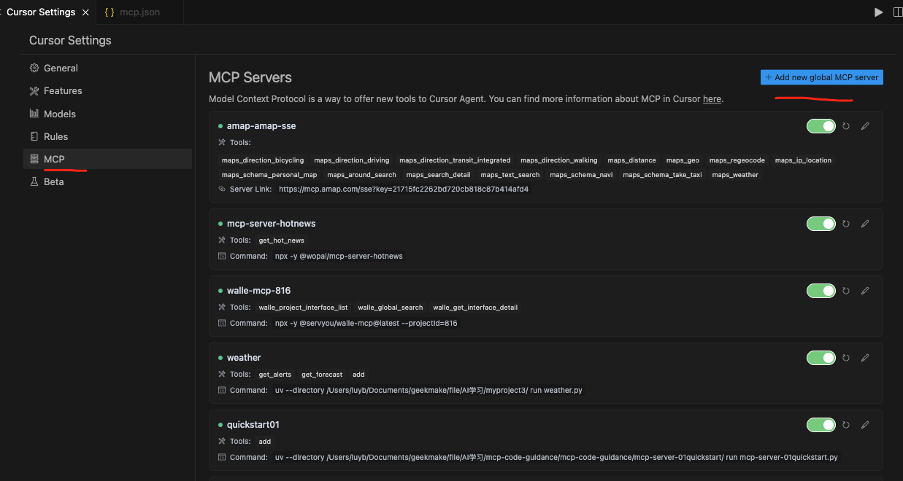

# Quick Start

mcp-server-quickstart01 快速构建一个简单的MCP服务，以便在客户端（Cursor、Trae 等）中使用。

## 安装步骤

```shell
# uv 初始化项目
uv init -p3.11 mcp-server-quickstart01

# 创建以及激活虚拟环境
uv venv --python /Library/Frameworks/Python.framework/Versions/3.11/bin/python3
source .venv/bin/activate  # Linux/MacOS环境
.venv\Scripts\activate     # Windows环境

# 安装依赖
#使用默认pipy镜像源可能会由于网速原因无法成功下载安装。此步骤设置为清华镜像源 https://pypi.python.org/simple。
uv add "mcp[cli]" httpx --index-url "https://pypi.tuna.tsinghua.edu.cn/simple/"
uv pip install --python=3.11 "mcp[cli]" httpx --index-url "https://pypi.tuna.tsinghua.edu.cn/simple/"

```

### 运行服务
```
mcp dev mcp-server-01quickstart.py
```

+ MCP Inspector调试 

MCP Inspector 是专为MCP Server设计的交互式调试工具，支持开发者通过多种方式快速测试与优化服务端功能。



### 客户端使用
+ cusor 客户端
打开 Cursor Settings 窗口，添加一个新的 MCP Server，设置如下：



```json
{
  "mcpServers": {
    "quickstart01": {
          "command": "uv",
          "args": [
            "--directory",
            "/xxx/mcp-code-guidance/mcp-server-01quickstart/",
            "run",
            "mcp-server-01quickstart.py"
          ]
    }
  }
}
```


+ trae 客户端

### 功能描述
+ MCP 服务可以提供三种主要类型功能：
>Resources：客户端可以读取的类似文件的数据（如 API 响应或文件内容）
>Tools：LLM 可以调用的函数
>Prompts：帮助用户完成特定任务的预先编写的模板


+ 构建 MCP 服务
```
mcp = FastMCP(
    name="这是FastMCP的参数name",
    instructions="""
    这是FastMCP的参数instructions.
    """
)
```

官方文档使用 @mcp.tool() 装饰器定义 Tools，使用@mcp.resource() 定义 Resources，使用 @mcp.prompt() 定义 Prompts。

参考:[python sdk](https://github.com/modelcontextprotocol/python-sdk)


